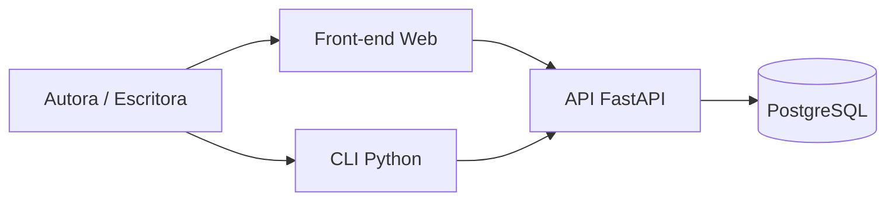

# Architecture Decision Document — InspireScript

**Autora:** Autora  
**Data:** 2026-05-15  
**Versão:** 1.0  
**Status:** Completo (brownfield → MVP)

Este documento é a **fonte de verdade arquitetural** para implementação por agentes de IA. Complementa `docs/architecture.md` (análise do estado atual) com **decisões**, **padrões** e **estrutura alvo**.

**Rastreabilidade:** [`prd.md`](./prd.md) · [`project-context.md`](../project-context.md)

---

## 1. Contexto e escopo arquitetural

### 1.1 Resumo do produto

Plataforma web para organização de ideias literárias: ideias, gêneros, subgêneros, personagens (com papéis) e cenários, com histórico de alterações na descrição.

### 1.2 Estado brownfield

| Camada | Situação |
|--------|----------|
| PostgreSQL + DDL | ✅ Maduro |
| Repositórios (SQL cru) | ✅ 10 módulos |
| CLI | ✅ Parcial |
| API FastAPI | ⚠️ 3 rotas, sem JSON estruturado |
| Front-end | ❌ Ausente |
| Testes / `.env` | ❌ Ausente |

### 1.3 Requisitos que dirigem a arquitetura

| Tipo | Quantidade | Impacto |
|------|------------|---------|
| FR | 36 | CRUD completo + API + UI |
| NFR | 13 | Performance local, segurança, manutenibilidade |
| MVP | Fase 1 | API completa + UI mínima + correções técnicas |

### 1.4 Restrições

- Manter PostgreSQL e scripts SQL versionados existentes
- Não introduzir ORM no MVP (decisão explícita no PRD)
- Stack backend já escolhida: Python + FastAPI
- UI em HTML/CSS/JS (README) — evitar framework pesado no MVP
- Português (pt-BR) na UI e mensagens de erro

---

## 2. Visão arquitetural (alvo MVP)

### 2.1 Estilo arquitetural

**Arquitetura em camadas (4 camadas)** com boundaries claros:

```
┌─────────────────────────────────────────────────────────────┐
│  Apresentação (front/)                                       │
│  HTML + CSS + JS · fetch → API                               │
└────────────────────────────┬────────────────────────────────┘
                             │ HTTP/JSON
┌────────────────────────────▼────────────────────────────────┐
│  API (back/core/api/)                                        │
│  FastAPI · routers · schemas Pydantic · exception handlers   │
└────────────────────────────┬────────────────────────────────┘
                             │
┌────────────────────────────▼────────────────────────────────┐
│  Serviços (back/core/services/)                              │
│  Orquestração · validação de negócio · mapeamento DTO        │
└────────────────────────────┬────────────────────────────────┘
                             │
┌────────────────────────────▼────────────────────────────────┐
│  Repositórios (back/core/repositories/)                      │
│  SQL parametrizado · retorna dict/list · sem print           │
└────────────────────────────┬────────────────────────────────┘
                             │ psycopg2
┌────────────────────────────▼────────────────────────────────┐
│  PostgreSQL (inspire_script)                                 │
└─────────────────────────────────────────────────────────────┘

        CLI (back/core/cli/) ──► Serviços (mesma lógica que API)
```

**Princípio:** repositórios não conhecem HTTP nem terminal; serviços não contêm SQL; rotas não contêm SQL.

### 2.2 Diagrama de contexto (C4 — nível 1)



*Nota MVP:* CLI pode chamar **serviços** diretamente (sem HTTP) para evitar overhead; API e CLI compartilham a camada de serviços.

### 2.3 Diagrama de containers (nível 2)

| Container | Tecnologia | Responsabilidade |
|-----------|------------|------------------|
| `front` | Vite + HTML/CSS/JS | UI, chamadas REST, validação de formulário |
| `api` | FastAPI 0.135 + uvicorn | REST, OpenAPI, CORS |
| `core` | Python 3.10+ | Serviços + repositórios |
| `database` | PostgreSQL 14+ | Persistência, triggers, integridade |

---

## 3. Decisões arquiteturais (ADRs)

### ADR-001 — Banco de dados: PostgreSQL

| | |
|---|---|
| **Status** | Aceito |
| **Contexto** | DDL e código já em PostgreSQL; docs legados citavam MySQL |
| **Decisão** | PostgreSQL 14+ como único SGBD |
| **Consequências** | Manter scripts em `back/database/`; documentação alinhada |

### ADR-002 — Persistência: SQL explícito (sem ORM no MVP)

| | |
|---|---|
| **Status** | Aceito |
| **Contexto** | Repositórios com psycopg2 funcionais; SQLAlchemy no requirements sem uso |
| **Decisão** | Continuar com psycopg2 + SQL parametrizado; remover SQLAlchemy do requirements no MVP ou marcar opcional |
| **Consequências** | Mais controle; repositórios devem retornar estruturas de dados, não `print` |

### ADR-003 — API: FastAPI modular com versionamento

| | |
|---|---|
| **Status** | Aceito |
| **Decisão** | Prefixo `/api/v1`; um `APIRouter` por agregado (`ideias`, `generos`, `personagens`, `cenarios`, `logs`) |
| **Consequências** | `back/core/main.py` monta routers; OpenAPI em `/docs` |

### ADR-004 — Camada de serviços

| | |
|---|---|
| **Status** | Aceito |
| **Contexto** | Repositórios misturam persistência e `print`; API precisa JSON |
| **Decisão** | Introduzir `back/core/services/` — uma classe ou módulo por agregado chamando repositórios |
| **Consequências** | Refatoração dos repositórios para retornar `dict` / `list[dict]` / `Optional[dict]`; CLI chama serviços |

### ADR-005 — Front-end: Vite + JavaScript vanilla (MPA leve)

| | |
|---|---|
| **Status** | Aceito |
| **Alternativas** | React, Vue — rejeitados no MVP por custo de setup |
| **Decisão** | `front/` com Vite, páginas HTML, módulos ES, `fetch` para API |
| **Consequências** | Sem SSR; CORS na API; build estático servido por Vite dev ou nginx futuro |

### ADR-006 — Configuração: variáveis de ambiente

| | |
|---|---|
| **Status** | Aceito |
| **Decisão** | `pydantic-settings` + `.env`; `.env.example` commitado; `config_banco.py` lê settings |
| **Consequências** | Remover credenciais hardcoded (NFR3) |

### ADR-007 — Autenticação adiada (Growth)

| | |
|---|---|
| **Status** | Aceito para MVP |
| **Decisão** | Sem auth no MVP (uso local/pessoal); preparar middleware stub em `api/deps.py` |
| **Consequências** | NFR5 na fase Growth: JWT ou sessão cookie |

### ADR-008 — Empacotamento Python unificado

| | |
|---|---|
| **Status** | Aceito |
| **Decisão** | Tratar `back` como pacote; imports `from back.core.services import ideia_service`; executar uvicorn como `uvicorn back.core.main:app` da raiz |
| **Consequências** | Elimina split `core.*` vs `back.core.*`; adicionar `pyproject.toml` ou `setup.cfg` opcional |

### ADR-009 — Histórico de ideias via trigger

| | |
|---|---|
| **Status** | Aceito (existente) |
| **Decisão** | Manter trigger `trg_log_ideia`; serviços não duplicam lógica de log |
| **Consequências** | Updates de `descricao` passam pelo repositório padrão |

### ADR-010 — IA / agentes (Vision)

| | |
|---|---|
| **Status** | Proposto (fora do MVP) |
| **Decisão** | Módulo futuro `back/core/agent/` consumindo API interna ou serviços |
| **Consequências** | API estável é pré-requisito |

---

## 4. Stack tecnológica (versões)

| Componente | Versão | Notas |
|------------|--------|-------|
| Python | 3.10+ | 3.13 compatível |
| FastAPI | 0.135.1 | |
| uvicorn | 0.42.0 | |
| Pydantic | 2.12.5 | Schemas request/response |
| pydantic-settings | *adicionar* | Config |
| psycopg2-binary | *adicionar* | Driver BD |
| PostgreSQL | 14+ | |
| Vite | 6.x (latest stable) | Dev front |
| Node.js | 20+ LTS | Apenas build front |

---

## 5. Padrões de implementação (regras para agentes)

### 5.1 Nomenclatura

| Área | Convenção | Exemplo |
|------|-----------|---------|
| Tabelas/colunas BD | snake_case | `id_ideia`, `id_genero_principal` |
| Endpoints REST | plural, kebab se composto | `GET /api/v1/ideias/{id}` |
| JSON API | snake_case (alinha BD) | `{ "id_ideia": 1, "titulo": "..." }` |
| Arquivos Python | snake_case | `ideia_service.py` |
| Classes serviço | PascalCase + Service | `IdeiaService` |
| Schemas Pydantic | PascalCase | `IdeiaCreate`, `IdeiaResponse` |
| JS front | camelCase variáveis; arquivos kebab | `ideia-form.js` |

### 5.2 Formato de resposta API

**Sucesso (lista):**
```json
{ "data": [ ... ], "meta": { "total": 42 } }
```

**Sucesso (item):**
```json
{ "data": { "id_ideia": 1, "titulo": "..." } }
```

**Erro:**
```json
{
  "error": {
    "code": "GENERO_NOT_FOUND",
    "message": "Gênero principal não encontrado.",
    "field": "id_genero_principal"
  }
}
```

**HTTP:** `201` create · `200` read/update · `204` delete · `400` validação · `404` não encontrado · `409` conflito FK

### 5.3 Repositórios (refatoração)

```python
# Assinatura alvo — sem print, sem return None silencioso em listagens
def listar_ideias() -> list[dict]: ...
def inserir_ideia(...) -> dict: ...  # retorna registro criado com id
def buscar_ideia_detalhada(id_ideia: int) -> dict | None: ...
```

- Exceções de domínio: levantar `RepositoryError` ou retornar `None`; serviço traduz para HTTP
- Transações: uma operação = uma conexão; multi-tabela futura usa `with conexao:` explícito

### 5.4 Serviços

- Validar regras de negócio (título não vazio, IDs positivos)
- Montar agregados para “detalhe da ideia” (join lógico de subgêneros, elenco, cenários)
- Não importar FastAPI

### 5.5 API (FastAPI)

- Routers em `back/core/api/routers/`
- Schemas em `back/core/api/schemas/`
- `exception_handlers` globais para formato de erro único
- `CORSMiddleware`: `http://localhost:5173` (Vite default)

### 5.6 Front-end

- Um módulo `front/src/api/client.js` — base URL configurável
- Páginas por domínio: `ideias.html`, `personagens.html`, etc. ou SPA mínima com roteamento hash
- Feedback de erro: exibir `error.message` da API

### 5.7 Testes

```
tests/
├── unit/
│   └── services/
├── integration/
│   ├── api/          # TestClient FastAPI
│   └── repositories/ # BD de teste inspire_script_test
└── conftest.py
```

- `pytest` + `httpx` (TestClient)
- Fixture: aplicar schema de teste via scripts SQL

---

## 6. Estrutura de projeto (alvo)

```
Inspire_Script/
├── .env.example
├── requirements.txt          # + psycopg2-binary, pydantic-settings
├── pyproject.toml            # opcional — pacote back
├── README.md
│
├── back/
│   ├── core/
│   │   ├── main.py           # app FastAPI, mount routers, CORS
│   │   ├── api/
│   │   │   ├── routers/
│   │   │   │   ├── ideias.py
│   │   │   │   ├── generos.py
│   │   │   │   ├── personagens.py
│   │   │   │   ├── cenarios.py
│   │   │   │   └── logs.py
│   │   │   ├── schemas/
│   │   │   ├── deps.py
│   │   │   └── exceptions.py
│   │   ├── services/
│   │   │   ├── ideia_service.py
│   │   │   ├── genero_service.py
│   │   │   └── ...
│   │   ├── repositories/     # existente — refatorado
│   │   ├── config/
│   │   │   └── settings.py   # pydantic-settings
│   │   └── cli/
│   │       └── menu.py       # usa services
│   └── database/
│       ├── schema.sql/
│       ├── seed.sql/
│       └── selects.sql/
│
├── front/
│   ├── index.html
│   ├── package.json
│   ├── vite.config.js
│   └── src/
│       ├── api/client.js
│       ├── pages/
│       └── styles/
│
├── tests/
│   ├── conftest.py
│   ├── unit/
│   └── integration/
│
├── docs/                     # project_knowledge
└── _bmad-output/
    └── planning-artifacts/
        ├── prd.md
        ├── architecture.md   # este arquivo
        └── decision-log.md
```

### 6.1 Mapeamento FR → componentes

| Área FR | Router | Service | Repository |
|---------|--------|---------|------------|
| FR1–FR7 Ideias | `routers/ideias.py` | `ideia_service` | `ideia.py` |
| FR8–FR13 Gêneros | `routers/generos.py` | `genero_service` | `genero.py`, `subgenero.py`, `ideia_subgenero.py` |
| FR14–FR20 Personagens | `routers/personagens.py` | `personagem_service` | `personagem.py`, `papel_personagem.py`, `ideia_personagem.py` |
| FR21–FR25 Cenários | `routers/cenarios.py` | `cenario_service` | `cenario.py`, `ideia_cenario.py` |
| FR26–FR27 Logs | `routers/logs.py` | `log_service` | `log_ideia.py` |
| FR31–FR35 UI | `front/src/pages/*` | — | via API |

---

## 7. Modelo de dados (referência)

Modelo relacional existente — **sem alteração no MVP** salvo índices ou correções.

Entidades principais: `genero`, `subgenero`, `ideia`, `ideia_subgenero`, `personagem`, `papel_personagem`, `ideia_personagem`, `cenario`, `ideia_cenario`, `log_alteracao_ideia`.

Detalhes: [`docs/data-models.md`](../../docs/data-models.md)

**Agregado “Ideia detalhada” (leitura):** serviço compõe:

```
Ideia + genero_nome + subgeneros[] + elenco[] + cenarios[] 
```

Endpoint sugerido: `GET /api/v1/ideias/{id}/completo`

---

## 8. Segurança e operação

| Tópico | MVP | Growth |
|--------|-----|--------|
| Secrets | `.env`, não commitar | Vault / CI secrets |
| SQL injection | Queries parametrizadas | Revisão estática |
| CORS | Localhost Vite only | Domínio produção |
| Auth | Nenhuma | JWT ou session |
| HTTPS | Dev HTTP | TLS em deploy |
| Backup | Manual pg_dump | Automatizado |

---

## 9. Sequência de implementação (MVP)

Ordem recomendada para agentes — **minimiza conflitos**:

1. **Fundação:** `.env`, `settings.py`, `requirements.txt`, pacote `back` unificado
2. **Repositórios:** refatorar retornos (sem `print`); manter assinaturas estáveis
3. **Serviços:** criar camada; cobrir todos os agregados
4. **API:** routers + schemas + erros; paridade com CLI
5. **CLI:** apontar para serviços; corrigir bug subgênero
6. **Testes:** integração API + repositório crítico
7. **Front:** Vite scaffold → ideias → gêneros → personagens → cenários → logs
8. **Docs:** atualizar `docs/api-contracts.md`, README

---

## 10. Validação arquitetural

### 10.1 Coerência

| Verificação | Resultado |
|-------------|-----------|
| Stack compatível | ✅ Python/FastAPI/PostgreSQL/Vite |
| Padrões alinhados a ADRs | ✅ |
| Brownfield respeitado | ✅ Evolução incremental |
| Sem contradição ORM | ✅ SQL cru mantido |

### 10.2 Cobertura de requisitos

| Grupo | Cobertura | Lacuna |
|-------|-----------|--------|
| FR1–FR27 (dados) | ✅ Serviços + API + repos | Refatoração necessária |
| FR28–FR30 (API) | ✅ Routers v1 | Implementar |
| FR31–FR35 (UI) | ✅ front/ | Criar do zero |
| NFR1–NFR4 | ✅ | Benchmark após refactor |
| NFR5 Auth | ⏸️ Growth | Planejado |
| NFR8–NFR10 | ✅ | Convenções documentadas |

### 10.3 Riscos e mitigação

| Risco | Mitigação |
|-------|-----------|
| Refatoração grande dos repositórios | Incremental por módulo; testes por agregado |
| Scope creep no front | Páginas MVP fixas no PRD |
| Imports quebrados | ADR-008 primeiro |
| Trigger log esquecido | Teste integração update descrição |

---

## 11. Relação com outros artefatos

| Documento | Papel |
|-----------|-------|
| `prd.md` | O quê construir |
| `architecture.md` (este) | Como construir |
| `project-context.md` | Regras para agentes |
| `docs/architecture.md` | Snapshot técnico brownfield |
| `docs/api-contracts.md` | Contratos HTTP (atualizar pós-implementação) |

---

## 12. Próximos passos (BMAD)

1. **`bmad-create-epics-and-stories`** — quebrar MVP em épicos/histórias rastreáveis ao PRD
2. **`bmad-check-implementation-readiness`** — validar PRD + arquitetura + epics
3. **`bmad-sprint-planning`** → **`bmad-dev-story`** — implementação

---

_Arquitetura gerada pelo workflow BMAD `bmad-create-architecture`._
